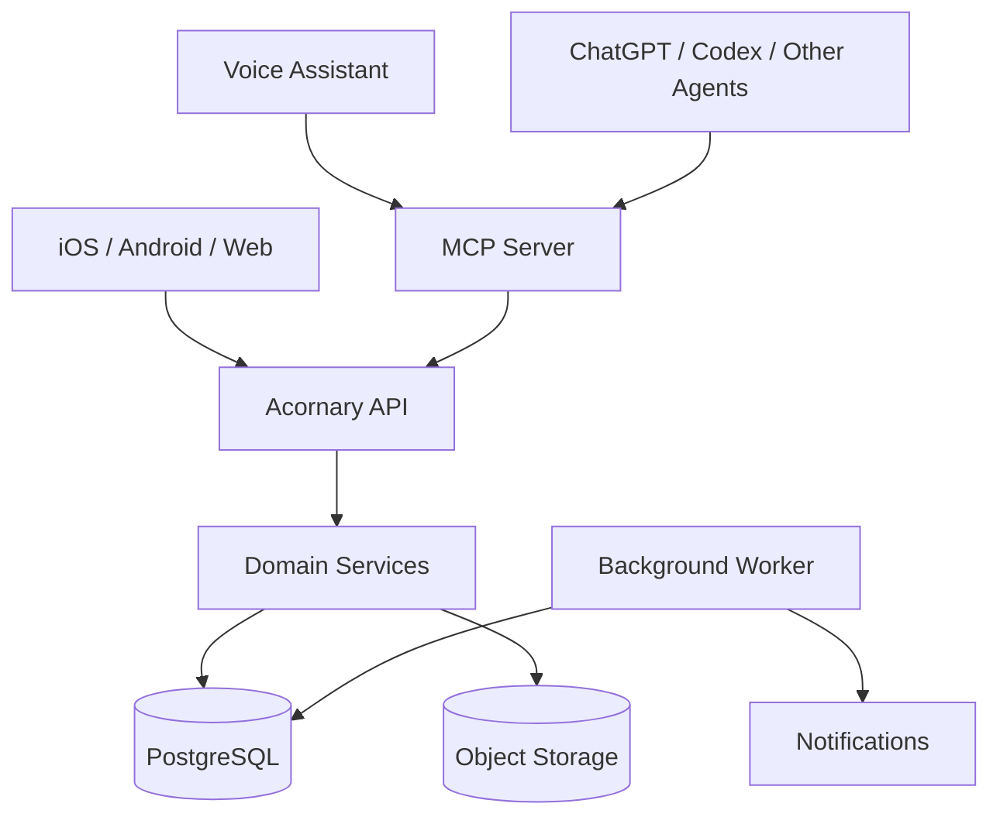

# Architecture v1

## 1. System shape



核心原则：

> MCP Server 和 App 都是 client；业务真相存在 Domain Service，而不是 LLM prompt 或 MCP wrapper 中。

---

## 2. Layers

### Clients

- Mobile / Web app
- Voice assistant
- ChatGPT / Codex / 其他支持 MCP 的 agent

Clients 不直接访问数据库。

### Acornary API

负责：

- authentication
- authorization
- input validation
- API contracts
- 调用 Domain Services

### Domain Services

负责：

- category / type / entry 的业务约束
- quantity change
- FEFO / consumption allocation
- location move
- state transition
- note management
- event creation
- transaction boundary

### PostgreSQL

保存：

- taxonomy
- item types
- inventory entries
- locations
- attribute definitions
- notes metadata / text
- events

### Object Storage

保存：

- Note 图片
- 未来的原始文件附件

### Background Worker

负责：

- expiry reminders
- low-stock reminders
- scheduled summaries
- 可选的 AI 派生任务（OCR / embedding / image caption）

Worker 不负责维护本可实时推导的事实状态。

---

## 3. AI / MCP boundary

LLM 不应生成任意 SQL，也不应直接更新数据库。

正确路径：

```text
Natural language
    ↓
LLM
    ↓
Typed MCP tool
    ↓
Acornary API
    ↓
Domain Service
    ↓
Database transaction
```

错误路径：

```text
LLM
  ↓
arbitrary SQL
  ↓
database
```

原因：

- 无法稳定执行 domain invariants
- 难以审计
- 难以控制权限
- schema 变化会污染 prompt
- 容易造成不一致状态

---

## 4. Example write flow: “我刚用了两个鸡蛋”

假设数据库中：

```text
Egg Lot A
quantity   = 6 count
expires_at = 2026-09-25

Egg Lot B
quantity   = 12 count
expires_at = 2026-10-10
```

LLM 只需要调用：

```text
consume_item(
  item = "鸡蛋",
  amount = 2,
  unit = "count"
)
```

Domain Service：

1. 解析目标 ItemType / InventoryEntry 候选。
2. 只选择当前有效库存。
3. 按 FEFO（First Expired, First Out）排序。
4. 从 Lot A 扣减 2。
5. 将 Lot A 的 quantity 从 6 改为 4。
6. 创建 `InventoryEvent(type=CONSUME, quantity_delta=-2, source=VOICE_ASSISTANT)`。
7. 在同一事务中提交。

LLM 无需知道底层 SQL。

---

## 5. Example read flow: “我能做番茄炒蛋吗？”

Recipe / intent layer 将需求解析为：

```text
Tomato: 300 g
Egg:    3 count
```

然后通过 Acornary API 查询有效库存：

```text
Tomato:
  450 g
  Home > Kitchen > Refrigerator

Egg:
  Lot A: 2 count, expires 2026-09-25
  Lot B: 8 count, expires 2026-10-10
```

Agent 可以得出：

- 原料总量足够；
- 鸡蛋应优先使用 Lot A；
- 具体库存扣减仍必须通过 `consume_item` 等领域操作执行。

Recipe 本身不应侵入 InventoryEntry 数据模型，可以作为未来独立模块。

---

## 6. MCP v1 surface

建议初版保持小而稳定：

```text
search_items
get_item

create_item
update_item

consume_item
adjust_quantity

move_item
update_item_state

get_expiring_items
get_low_stock_items

add_note
update_note
add_note_image
```

原则：

- MCP tool 名称使用清晰的 domain vocabulary。
- 不把品牌词（Acorn / Stash / Nut）写进核心 tool contract。
- 一个 tool 对应明确业务意图，而不是“execute_sql”。

---

## 7. Transaction boundaries

以下操作必须事务化：

### Quantity changes

```text
update InventoryEntry
+
insert InventoryEvent
```

要么一起成功，要么一起失败。

### Location moves

```text
validate target location
+
update InventoryEntry.location_id
+
insert MOVE event
```

### State changes

```text
validate transition
+
update lifecycle / condition / availability
+
insert CHANGE_STATE event
```

Note 图片上传可采用两阶段流程：

1. 创建 upload intent / signed URL。
2. 客户端上传 Object Storage。
3. 完成 attachment record。

需要后台清理孤立对象。

---

## 8. Query strategy

常用查询必须不依赖 LLM：

- 按 category 查
- 按 location / location subtree 查
- 当前有效库存
- 即将过期
- 已过期
- 低库存
- 按 structured attributes 过滤
- 按 ItemType / brand / name 搜索

Note 的全文搜索与语义搜索可以作为后续增强：

```text
structured filters
+
full-text search
+
optional embeddings
```

结构化事实的精确查询优先于 embedding。

---

## 9. Background jobs

适合 Worker 的任务：

- “3 天内将过期”提醒
- 低库存提醒
- 定时汇总
- Note 图片 OCR
- Note / image caption embedding
- 孤立附件清理

不适合 Worker 的任务：

- 每晚把所有 `status` 改成 `expired`

因为 expiry 本身可由 `expires_at` 推导。

---

## 10. Initial deployment recommendation

v1 可以保持简单：

```text
API service
MCP service
Worker
PostgreSQL
S3-compatible object storage
```

API、MCP 和 Worker 可以先存在同一 monorepo，按进程 / entrypoint 分离；不要为了“微服务”过早拆分领域边界。
