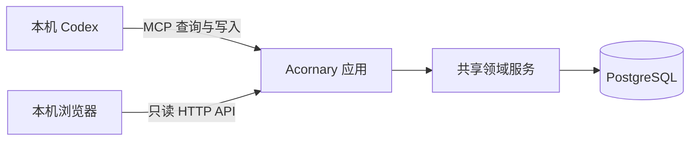
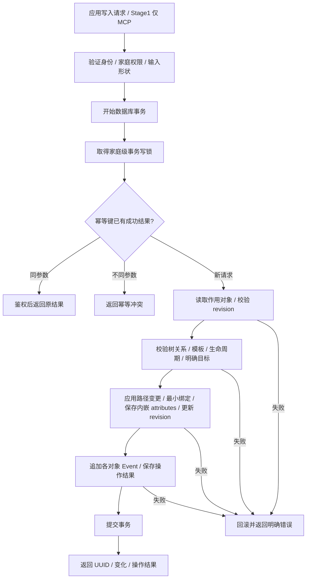

# Architecture v1

本文件定义两棵树模型的应用边界和接口契约，配合 [Domain model](./domain-model.md) 和 [Examples](./examples.md) 使用。Stage1 已有运行代码、锁文件、数据库 migration 与测试。启动方式见 [本地运行](./local-runtime.md)，实际验证与待完成项见 [验证记录](./stage1-verification.md)。

## 1. 交付形态与技术选择

### 1.1 Stage1 已确认边界

Stage1 是本地库存操作与只读模型检查器，完成“通过 Codex 管理物品 → 数据持久化 → 在 Web 核对结构、属性和历史”的闭环。应用、PostgreSQL、Codex 和浏览器运行在同一台电脑上，不提供局域网访问。

Stage1 支持日常库存操作和文字 Note；Web 只读。操作仅接受明确 UUID，自动等价选取与 FEFO 后置。云托管、ChatGPT 接入、HTTPS、OAuth、注册登录、模板发布／升级、自定义模板设计器、图片附件、OCR、主动提醒和后台任务系统均属于后续阶段。

主要入口是用户已有的 AI 助手／MCP host。自然语言理解由已有助手承担，Acornary 负责确定性的查询、校验和写入；核心系统不要求模型 API key，也不要求自建聊天界面。长期保留云服务器托管方向与 Docker Compose 自托管能力。

### 1.2 技术栈与阶段

采用 TypeScript 模块化单体：领域命令、模板校验、MCP 工具和 Web 共用契约，两棵树、属性快照和事件使用同一数据库事务。实际依赖版本由 pnpm-lock.yaml 锁定；Node 24 容器构建和测试，不更改宿主机 Node 版本。

| 层 | 确定选型 | Stage1 用途或阶段 |
| --- | --- | --- |
| 语言与运行时 | TypeScript strict、Node.js 24 LTS、pnpm workspace | 前后端共享类型，领域规则可独立测试 |
| 应用结构 | 模块化单体 | 一套应用服务、一套事务，部署一个应用 |
| HTTP 服务 | Fastify 5 | 只读查询 API、MCP 入口与 Web 静态资源 |
| MCP | 官方 TypeScript SDK v2、官方 Fastify 适配器、Streamable HTTP | 本地 Codex 通过 /mcp 调用共享应用服务 |
| 数据库 | PostgreSQL 18 | 关系约束、递归查询、JSONB、事务及事件历史 |
| 数据访问 | Drizzle ORM、node-postgres、显式 SQL migration | 通过 Drizzle 执行绑定参数 SQL；约束、锁与递归查询使用显式 SQL |
| 契约与模板 | Zod 4、生成的 JSON Schema | 七个内置模板 v1、工具参数及只读 HTTP 契约 |
| 本地身份 | 初始化生成的个人访问凭证、统一操作者与 Household 上下文 | MCP 凭证校验，Web 本机只读浏览无需登录 |
| 云端身份 | Better Auth 及其 MCP / OAuth 插件 | 后续阶段接入；Stage1 不实施 |
| Web | React、Vite、TanStack Router / Query | 双树导航、详情、文字笔记与事件的只读 SPA |
| 计量 | decimal.js | 十进制字符串参与精确运算，避免浮点误差影响剩余量 |
| 本地部署 | Docker Compose、持久卷 | 同机运行应用与 PostgreSQL，端口仅在本机可达 |
| 云端入口 | Linux 云服务器、Caddy、HTTPS | 后续阶段接入；Stage1 不实施 |
| 测试与日志 | Vitest、真实 PostgreSQL 集成测试、Playwright、Pino | 分别验证领域、数据库约束、只读浏览流程及运行故障 |

### 1.3 Stage1 本地运行与连接



Docker Compose 启动应用和 PostgreSQL，应用同时提供 MCP、只读 HTTP API 和 Web 静态资源。宿主机应用端口仅绑定 `127.0.0.1`；PostgreSQL 仅供 Compose 内部访问，不向宿主机发布数据库端口。数据库使用持久卷，停止及重启不能丢失数据。

本机 Codex 使用本地 Streamable HTTP 连接 `/mcp`，携带初始化生成的个人访问凭证；Stage1 不增加 stdio 桥接。Web 本机只读浏览无需登录，不获得 MCP 写入凭证；只读 API 不暴露业务写接口。MCP 与只读 API 直接调用同一应用服务，不相互转发 HTTP。

初始化创建默认 Household、七个内置模板 v1 和隐藏通用容器 SKU，建立本地操作者上下文；重复初始化不得重复创建或改变已有对象身份。家庭仍是权限边界，不能仅由客户端输入决定。保留统一操作者与 Household 上下文，后续可映射到 OAuth 身份。

Compose、初始化、Codex 包装脚本与操作说明已提供，见 [本地运行](./local-runtime.md)。Stage1 的备份与恢复覆盖 PostgreSQL 中的关系、属性、文字笔记、模板版本和事件，以及配置和访问凭证。

### 1.4 数据模型的技术映射

- CatalogNode、Item 使用关系表与 parent_id；通过递归 CTE 查询子树和位置路径。核心关系使用外键、唯一约束和 Household 边界，防环校验结合第 5 节的事务锁。
- items.attributes 与 catalog_nodes.attributes 使用 JSONB 数组，绑定值和创建／更新时间同对象行保存；缺省保持未知，不自动填充业务状态。常用属性按查询需求建立索引，不为同一事实增加可独立编辑的业务列。
- 模板由版本化 Zod 定义与元数据维护，生成公开 Schema 和不可变的数据库发布记录。Stage1 只支持七个内置注册模板 v1；已发布版本保留，升级能力在后续阶段显式执行。
- Zod 定义可公开表达的字段结构；生命周期、容纳、计量换算等跨字段或跨对象规则放在共享领域代码。公共 Schema 不使用无法准确导出的转换或隐藏默认值；未知字段直接拒绝，不由入口静默删除。
- HTTP、MCP 和属性更新调用同一套校验；ORM 类型标注不能替代 JSONB 的运行时校验。当前快照、revision、Event 和成功幂等结果在同一 PostgreSQL 事务内提交。
- 条码唯一映射使用同事务维护的派生索引表及唯一约束；属性仍是事实来源，索引不提供独立编辑入口。
- 保留已有命令名称、set / unset、affected_objects 和错误语义；技术选型不改变领域契约。

核心模型是 items、catalog_nodes、attribute_templates 三张表；加上 households、actors、notes、events、operations、barcode_index、installations、migrations，数据库共十一张表。属性绑定按 template_id 排序，缺省为 []，成员为 template_id、template_version、values、created_at、updated_at。

属性约束主要由共享领域服务保证：检查成员结构、同家庭模板版本、适用对象、同模板唯一及完整值。数据库仅对 attributes 检查非 null 和数组形状；核心关系约束保持。不存在属性模板引用触发器、模板外键或绑定唯一索引，直接 SQL 修改数组可绕过领域校验。所有正常写入口仍统一校验、加锁和记录事件。

### 1.5 Stage1 只读开发者检查器

双树围绕 CatalogNode 和 Item 组织对象关系。所有 ID 完整显示，界面不是任意表浏览器或 SQL 控制台。

| 区域 | 来源和边界 |
| --- | --- |
| 数据库记录 | 核心表行（含 attributes）、内嵌属性展开、绑定的模板版本、Note、Event、操作记录、条码索引；逐表保留全部列、null、时间和 JSONB |
| 派生结果 | parent_id 递归路径、关联商品名称、提醒日期及计算依据；明确标注非存储字段 |
| API 响应 | 实际 get_item / get_catalog_node 业务响应，可含拼装的关联记录；不称为数据库原始 JSON |
| 实例查询 | 名称、条码、生命周期和日期过滤；分开显示件数、未知生命周期数量、内容量汇总 |
| 固定检查视图 | 家庭、操作者、全部模板版本、操作记录（含无变化请求）、事件、笔记、条码索引、初始化槽位和迁移信息 |

以上覆盖当前全部 11 张表。数据库记录直接使用 PostgreSQL `to_jsonb(t)`，附列类型、数据库默认值及约束／外键说明；不通过业务对象反向构造。记录按页访问（默认 10，最高 200），完整 JSON 可展开、滚动、复制；未记录字段保留原 null 或缺失，不添加业务默认值。外键链接跳转至对应对象、模板版本、操作者或操作／事件记录。

固定只读端点 `GET /api/debug?input=<JSON>` 使用表白名单和预定义过滤，没有 SQL 或写入入口。各次读取在 READ ONLY + REPEATABLE READ 事务中执行，校验 Household/Actor；迁移表是安装级元数据，其他表按家庭隔离。Host / Origin 检查与业务 HTTP 一致，不公开访问凭证。分页是每次请求的一致快照；并发变更时刷新回首页重新读取，不承诺跨页固定历史快照。

允许树展开、查询、关联跳转、复制完整 ID、手动刷新；窗口聚焦及每 5 秒刷新当前视图。Note 同时显示完整原始 Markdown 和不执行原始 HTML 的安全预览。不提供编辑表单、拖拽移动、上传或其他业务写入交互；业务写入通过 MCP。

### 1.6 后续阶段保留方向

长期云托管通过 Caddy 提供 HTTPS；Web 使用会话，远程 MCP 使用 OAuth，并接入 ChatGPT。Better Auth、最小登录与授权页面、User 和成员关系按该阶段实现，公开注册及多用户管理仍需另行确定交付范围。

图片附件后续通过 BlobStore 接口访问，初始可用本地持久卷，未来可替换为 S3 兼容存储。可靠媒体任务或主动提醒采用 PostgreSQL 持久任务；关键投递不能仅依赖进程内定时器。以上不属于 Stage1 的依赖或验收条件。

## 2. 应用边界

应用服务负责鉴权、幂等、事务和错误结果。领域规则负责 CatalogNode 分类、Item 身份与容纳、模板校验、生命周期操作、Note 和 Event。模型把自然语言转成明确意图，数据库决定实际对象、事实与统计。

业务字段通过模板注册表发现，不硬编码成协议层散落的专有字段。核心 ID、父引用和对象版本使用专门命令，不允许通过属性接口修改。

HTTP 和 MCP 在共享能力上使用相同的输入和结果语义；Stage1 HTTP 仅暴露只读查询，写命令仅通过 MCP 暴露。MCP 提供结构化结果及简短摘要；摘要要能核对实际 UUID、变化、未知信息和选择依据。分页查询返回有界结果和游标，不让模型自行拼任意 SQL。

## 3. 公共操作契约

以下为 Stage1 MCP 工具及共享应用用例；HTTP 只读路由由相同查询契约导出。后续能力单独列出，不进入 Stage1 工具 Schema；v1 不保留旧接口别名。

| 能力 | 操作 | 主要输入 / 输出 |
| --- | --- | --- |
| 目录查询 | `query_catalog_nodes`、`get_catalog_node` | 分类子树、名称、模板条件、是否包含隐藏项；返回稳定 ID 与 revision |
| 目录管理 | `create_catalog_node`、`update_catalog_node`、`move_catalog_node` | 创建 kind/name/parent，修改 name，或移动 parent；ID 不可更新 |
| 实例查询 | `query_items`、`get_item` | SKU／分类子树、容器子树、模板条件；返回完整带前缀 ID、revision、模板绑定和统计；include_path=true 时附递归路径 |
| 入库 | `create_items` | catalog_node_id、parent_id、正整数 count、initial_attributes；返回全部新 UUID |
| 实例命名 | `update_item` | UUID、display_name；业务属性使用模板接口 |
| 移动 | `move_item` | UUID、新 parent_id；返回前后父引用 |
| 开封 | `open_item` | 明确 item_id；可选已知 opened_at；记录 lifecycle.opening.state=OPENED，不补 ACTIVE |
| 整件消耗 | `consume_items` | 明确 item_ids 列表；逐件记录 lifecycle.state=CONSUMED |
| 内容消耗 | `consume_item_content` | 单件 item_id、amount: MEASUREMENT、可选 accuracy: ESTIMATED / MEASURED；更新该件剩余量 |
| 盘点纠错 | `correct_item` | 明确 item_id、reason、可选 core 中的 catalog_node_id 或 attributes 中的模板 set / unset；不改 UUID |
| 模板发现 | `list_attribute_templates`、`get_attribute_template` | 对象种类、模板 ID 和版本；返回可绑定的受控定义 |
| 属性操作 | `get_attribute_sets`、`bind_attributes`、`update_attributes`、`remove_attributes` | target、template_id、固定版本；更新使用 set / unset，绑定使用 values；统一校验并更新对象 revision |
| 文字记忆 | `add_note`、`update_note` | Item / Note、Markdown 文字；读取由 get_item 及只读查询返回，修改记录所属 Item 的 Event |
| 历史 | `get_history` | target 或 operation_id、游标；返回不可变事件 |

Stage1 不注册 upgrade_attributes、create_attachment_upload、complete_attachment_upload，也不暴露模板发布接口。模板升级和附件接口属于后续契约。Stage1 不暴露 selection、EQUIVALENT 或 FEFO 参数；提交不属于工具 Schema 的参数必须拒绝。

`create_items.count` 是创建多少个实例的命令参数，不是存到某条实例上的聚合件数。initial_attributes 可省略，服务不自动补 ACTIVE 或其他业务属性。提供时只复制请求明确给出的模板和值；每个新对象形成独立绑定，不共享可被联动修改的属性记录。不同到期日或初始状态使用各自的入库请求。

固定实体响应不再附重复的 object_kind；CatalogNode.kind=GROUP/SKU 是实际存储字段。混合对象引用 target / affected_objects 仍使用 kind 判别。业务 attributes 每个列表成员仅含 template_id、template_version、values，无绑定 ID。所有实体 ID 采用领域文档中的完整前缀加标准 UUID；属性绑定以所属对象和模板键定位。

公开 API 的 `target` 为 `{ "kind": "ITEM", "id": "item_11111111-1111-4111-8111-000000000001" }` 或 CATALOG_NODE 对应形式。initial_attributes 与 bind_attributes 使用固定版本及嵌套 values，例如 `{ "template_id": "lifecycle", "template_version": 1, "values": { "expiry": { "date": "2026-09-25" } } }`；它只记录已知日期，不要求其他生命周期字段。

update_attributes 使用模板内相对路径 set / unset，未涉及的字段保持原值：

```json
{
  "target": {
    "kind": "ITEM",
    "id": "11111111-1111-4111-8111-000000000001"
  },
  "idempotency_key": "record-expiry-01",
  "expected_revisions": {
    "11111111-1111-4111-8111-000000000001": 1
  },
  "template_id": "lifecycle",
  "template_version": 1,
  "set": {
    "expiry.date": "2026-09-25"
  },
  "unset": []
}
```

统一更新规则：

- set 为路径到值的映射，unset 为要清除的路径列表；只接受模板声明的可写字段。普通嵌套对象按叶字段更新，Measurement 如 contents.remaining 作为原子字段，必须一起传 value 和 unit；不单独更新 remaining.value 或 remaining.unit。
- 同一路径同时 set / unset、重复 unset、父子重叠路径以及未知路径均拒绝。输入未提及的路径保持不变，null 不代表清除，清除使用 unset。
- 已有绑定必须匹配其固定版本；合法 set 可原子创建不存在的绑定。仅 unset 不创建空绑定，清除不存在的已声明字段是无变化操作。删除字段后裁剪空父对象，最后一个字段清空时移除绑定。
- bind_attributes 只建立未绑定模板，不作为覆盖现有绑定的入口；空 values 不创建空记录。后续阶段的 upgrade_attributes 显式提供目标版本与完整合法 values，不隐式升级；模板版本仍是协议必需信息，业务字段默认可选。
- 无论局部更新、升级还是 remove_attributes，都校验修改后的完整对象及领域约束。仍有子节点时不能移除 container.can_contain=true；清除或改写已知终结状态以恢复库存资格必须走 correct_item 并提供 reason，整模板移除也不能绕过。
- correct_item 的 attributes 列表复用 template_id、template_version、set、unset 结构；一件物品的多模板纠错在一个命令中提交，未涉及字段同样保留。

开封和整件消耗可以按领域命令定义的模板版本原子创建最小 lifecycle 绑定；已有绑定沿用其版本。单次用户意图无需先发 bind_attributes。核心 ID、父引用与目录关联不属于模板可写路径。

每个已存在对象的写入都携带 `expected_revisions`，为对象 ID 到当前 revision 的映射。写请求还携带 `idempotency_key`，可提供实际发生时间 `occurred_at`；家庭与操作者由认证上下文核对。创建对象没有旧 revision；被引用但未修改的 SKU／父容器仍必须在事务内检查存在性和合法性。

成功结果统一含 `operation_id`、`changed`、`affected_objects`（kind 为 CATALOG_NODE / ITEM、id、before_revision / after_revision）、`event_ids`、可读摘要；后续自动选取能力可另返回 `selection`。合法无变化返回 changed=false、空变更和空事件；稳定重试返回原结果。

通用属性接口与专用命令共用领域校验，不允许绕过内容归零、生命周期或容纳约束。内容归零时同一操作记录 CONSUMED，事件说明实际改变的所有路径。盘点发现多一件调用创建，少一件则明确某个 UUID 为 LOST 等状态；不直接写汇总件数。

v1 不提供通用硬删除工具。移除属性必须保持结构和状态一致；未来增加物理删除时仍须遵守被引用 SKU、非空容器和历史保留约束。

## 4. 明确目标与消耗

### 4.1 Stage1 仅操作明确 UUID

open_item、consume_item_content、correct_item 等接受明确 item_id，consume_items 接受明确 item_ids；expected_revisions 覆盖实际操作的已有对象。Codex 将自然语言目标解析为查询结果中的 UUID，用户无需手写 UUID。多个候选无法唯一定位时，Codex 展示候选并等待确认，不得在客户端代替服务自动选一件。

Stage1 不提供 selection、候选集合选取、EQUIVALENT 或 FEFO。create_items.count 仅表示创建的独立实例数；consume_items 不接受按 count 自动分配目标。

### 4.2 后续阶段的等价选取与 FEFO

以下规则保留为长期接口设计，不是 Stage1 的工具能力或验收要求。

明确 UUID 时直接验证目标；自然语言未指定单件时，先查询候选及其 revision，再携带有界候选集合提交。选择形状为 `selection: { policy, candidate_ids }`；整件消耗额外给 count，开封固定选择一件。

- **EQUIVALENT**：候选在影响操作的已知 SKU、位置、开封、日期、剩余量、生命周期及用户指定条件上等价，才可自动选择。候选可以共同缺少非必要状态，未知不自动变为 ACTIVE；已知终结状态仍被排除。等价候选按 UUID 稳定排序选取，并返回实际选中 UUID。
- **FEFO**：调用者显式要求优先到期，按已知有效提醒日期排序，同日按 UUID 排序。返回每个选中对象的日期与依据。它只解决到期日优先顺序，不授权忽略其他冲突条件。
- 候选包含未知日期、多个不能按指定策略消解的状态或不足数量时，返回可解释错误和候选，不静默猜测。调用者可以明确缩小候选集合；结果说明处理范围，不假装覆盖了所有库存。

expected_revisions 覆盖请求中的全部候选；服务在事务内重新检查它们。选择结果属于成功操作的一部分，幂等重试不能重新选另一件。UUID 自动分配记录身份，不替代现场的单件标签识别。

### 4.3 Stage1 内容消耗与开封

内容消耗要求已知 contents.remaining 和正数 amount，缺少 lifecycle.state 不阻止操作，也不补写 ACTIVE。已知终结状态返回 INVALID_TRANSITION；只有 accuracy 而无 remaining 时仍返回 MISSING_FACTS，并指出 contents.remaining 及计量用途。

可选 accuracy 表示本次扣减量的估计／实测性质。原量和扣减量均为 MEASURED 时结果为 MEASURED；均有已知 accuracy 且至少一个 ESTIMATED 时结果为 ESTIMATED；任一 accuracy 缺省时结果 accuracy 缺省，不沿用原来的实测标签。Stage1 仅接受同一已声明单位相减（mL、g、count、percent）；其他换算由调用方先明确转换依据，不超额、不取负值。percent 表示相对初始内容的百分点，例如剩 60、消耗 20 后为 40；不能将“剩余量的 20%”直接当作 20 个百分点。语义或换算依据不足时返回明确的缺失事实或单位错误。

食品的开封与内容消耗是不同意图：先开封后喝掉半瓶，是两个命令、两段历史。open_item 可以从未知开封状态记录 OPENED，可选补入请求明确给出的 opened_at，其他 lifecycle 字段保持不变；日期未知不补造。明确 OPENED 或仅有 opened_at 的对象都已知开封，重复开封不刷新日期或制造新事件。纠正开封时间使用 correct_item。

## 5. 写入流程与并发



一次命令的对象及其内嵌 attributes、Note 元数据、revision、Event 及成功幂等结果必须原子提交。Event 按领域模型的路径、存在性和前后值表达实际变化，不能把未涉及字段记为删除；隐式建立最小绑定同样属于该命令的一个对象事件。多个实例全部成功或全部回滚；后续命令冲突不会回滚此前独立完成的命令。

幂等键按家庭、认证主体、键建立唯一边界。同键同操作同参数返回原结果；同键不同参数返回冲突。同键并发提交必须串行获得同一个结果。重放在检查旧 expected_revisions 之前识别，避免成功请求重试因自身已更新版本而失败；重放仍检查当前访问权限。

Stage1 在鉴权后、幂等检查前取得家庭级事务 advisory lock，将同一家庭的所有写请求串行化；批量对象按稳定 ID 顺序处理并检查 revision。移动、建节点、修改容器能力共用此锁，防止并发操作共同形成环或破坏容纳关系。读取使用 REPEATABLE READ 只读事务。条码唯一映射同样需要事务内的冲突保护，不能只依赖写前查询。

| 错误码 | 行为 |
| --- | --- |
| `NOT_FOUND` / `FORBIDDEN` | 无合法访问范围，不返回其他家庭对象内容 |
| `REVISION_CONFLICT` | 快照已变化；在有权限范围内返回新版本，重新查询后形成新意图 |
| `IDEMPOTENCY_CONFLICT` | 同一个幂等键被用于不同操作或参数 |
| `INVALID_PARENT` / `CYCLE_DETECTED` | 非法父节点、跨家庭引用、环或缺少容器能力 |
| `MISSING_FACTS` | 确实缺少操作所需事实，返回所需完整路径及用途；不要求补齐整个模板 |
| `ATTRIBUTE_VALIDATION_FAILED` | 未知／重叠路径，字段、版本、单位、范围或条件依赖不合法 |
| `TEMPLATE_IN_USE` | 属性移除会破坏结构或状态约束 |
| `AMBIGUOUS_TARGET` / `INSUFFICIENT_STOCK` | 后续自动选取阶段的错误；Stage1 不注册选取策略 |
| `INVALID_TRANSITION` / `INSUFFICIENT_CONTENT` | 状态不允许该操作，或内容量不足 |
| `UNIT_MISMATCH` / `BARCODE_CONFLICT` | 无依据换算，或商品标识与其他 SKU 冲突 |

## 6. 查询、文字记忆与后续附件

query_items 返回实例及查询范围内的统计：matching_count 计入匹配记录，current_count 排除明确 CONSUMED / DISPOSED / LOST / ARCHIVED，但包含状态缺省对象；unknown_lifecycle_count 是 current_count 中状态缺省的子集。另说明可用性未知以及 content_totals 的缺失／估计性质。不能将 current_count 表述为已确认可用数量。

过滤使用 catalog_node_ids、catalog_subtree_id、within_item_id，以及受模板约束的 attribute_filters；属性条件使用 template_id、path（相对模板的路径）、op、value，v1 支持 eq 和日期窗口查询所需的 gte/lte。例如 lifecycle + expiry.date，或 lifecycle + state=ACTIVE；明确的值过滤只匹配已知值，缺省不命中。分页不改变统计范围，返回的统计针对请求过滤范围。

例如“冰箱里有多少奶”必须结合分类子树与容器子树；“能做番茄炒蛋吗”分别比较已知鸡蛋件数与番茄克数，缺失重量就报告信息不足。食谱推理不是库存写操作。低库存提醒使用明确阈值和统计口径，不把推理结果持久化成实物属性。

Stage1 Note 读取通过 get_item 及只读查询返回，同样检查家庭权限；add_note / update_note 与所属 Item revision、Event 同事务提交。搜索支持名称包含匹配、条码精确匹配和上述结构化过滤；中文搜索不依赖英文分词假设。

以下附件、OCR 与后台任务规则仅用于后续阶段：Note 和附件读取同样检查家庭权限。附件先上传暂存区，再校验类型／大小，完成数据库关联与事件。数据库事务不覆盖文件存储；关联失败保留可重试上传，后台清理过期未关联文件。OCR 和模型提取在事务之外运行，结果作为候选，不覆盖原始笔记或结构化事实。

后台任务按需做临期提醒、缩略图、清理和通知。若业务提交必须触发异步工作，在同一事务保存待投递记录，投递和 worker 均可重试、去重；不新增一套平行业务历史。日期流逝不批量改写对象状态。

## 7. 部署、恢复与后续验证

模块化单体中分离 domain、application、contracts 和 infrastructure，HTTP/MCP 是边缘适配器。领域模块不导入模型 SDK，也不承担自然语言生成。独立向量库、自建 agent 平台、离线多端写入同步不属于当前必需能力。

Stage1 备份覆盖 PostgreSQL、模板版本及配置和凭证，文字 Note 已在数据库内；后续有附件时加入原始文件备份。初期采用短暂停写的一致性备份，并恢复至独立空数据库核对；异机恢复尚未验证；JSON/CSV 导出用于可读迁移，不能替代完整备份。未来数据库迁移必须保留 CatalogNode 稳定 ID、Item UUID、模板版本和事件关联。

### Stage1 实现分层

代码已经按以下层次落地，实际完成度以验证记录为准：

1. **本地连接**：Compose 应用与 PostgreSQL、幂等初始化、本地个人访问凭证、真实本机 Codex 连接；Web 仅调用只读 API。
2. **领域核心**：两棵树、七个模板 v1、明确 UUID 的库存操作、文字 Note、事件、幂等和并发控制。
3. **只读模型检查器**：双树、详情、模板、实例列表、笔记、历史及刷新；验证与 MCP 读取相同事实。
4. **持久化与验收**：重启、备份恢复、真实 Codex 读写闭环及 Web 只读边界。

### Stage1 验收门槛

完整操作场景见 [Examples](./examples.md)。以下为验收标准；各项实际结果与客户端阻断单独记录，不能仅据此列表声称已全部通过：

- 创建目录、容器和六瓶牛奶，Web 显示六个不同 UUID，共用一个 SKU；开封并消耗指定一瓶的部分内容，其他五瓶不变，属性与事件可核对。
- 移动装有物品的容器，后代路径变化，不生成虚假的逐件移动事件；新增、修改文字 Note 可在 Web 核对正文与历史。
- 同键重试不重复创建或消耗；版本冲突、非法属性、防环、跨家庭隔离、并发消耗与批量回滚均符合领域契约，通用属性接口不能绕过约束。
- 模糊候选由 Codex 先澄清，服务不自动选择实例；工具 Schema 不暴露选取、升级或附件参数及工具。
- 重复初始化不重复生成 Household、模板或隐藏 SKU；停止、重启后数据完整；完成一次 PostgreSQL 备份恢复核对。
- Web 查询与 MCP 查询返回一致事实；Web 只读 API 无法写入，无有效凭证的 MCP 写入被拒绝。用两个家庭的测试数据验证隔离。

领域测试使用 Vitest，事务与并发测试使用真实 PostgreSQL，只读 Web 关键浏览流程使用 Playwright。实际 MCP 验收目标为本机 Codex；ChatGPT、OAuth、附件、模板升级和后台任务按后续阶段另行验收。

### 选型参考

以下资料用于记录选型依据，查阅日期为 2026-09-22；实际使用版本以锁文件和验证记录为准。

- [Node.js 发布周期](https://nodejs.org/en/about/previous-releases) 与 [PostgreSQL 支持周期](https://www.postgresql.org/support/versioning/)。
- [官方 MCP TypeScript SDK v2](https://ts.sdk.modelcontextprotocol.io/v2/) 与 [Fastify 适配器](https://ts.sdk.modelcontextprotocol.io/v2/api/@modelcontextprotocol/fastify/)。
- [Better Auth MCP 授权集成](https://better-auth.com/docs/plugins/mcp) 与 [OpenAI 插件认证要求](https://developers.openai.com/plugins/build/auth)。
- [Zod JSON Schema 转换边界](https://zod.dev/json-schema) 与 [Drizzle JSONB 类型边界](https://orm.drizzle.team/docs/column-types)。
- [Caddy 自动 HTTPS](https://caddyserver.com/docs/automatic-https)。

## 8. 统一 ID 增量迁移（历史 schema 002）

`001_initial.sql` 保持原样；`002_unified_ids.sql` 在停写、备份之后由迁移器在单事务中执行。迁移更新主外键、Event 结构化引用（含 notes.<note_id> 路径）、操作结果的对象／事件／笔记／操作标识，移除属性绑定 ID；不替换名称、笔记正文、原因或其他自由文本，不改变业务 revision、时间、物品属性或事件数量。

事件和模板的追加保护仅在此受控事务内暂时关闭，转换后恢复；事务失败整体回滚。已执行迁移通过 migrations 表跳过，初始化不创建新身份。既有 UUID 部分保留，类型由数据库 text + CHECK 校验。迁移操作方式见本地运行文档。

operations.fingerprint_format 将已有记录标为 legacy_v1，新记录默认为 unified_v1。旧指纹不可逆，重放时仅把请求的结构化 ID 按旧生成规则规范化后验证原哈希；用户文本及幂等键不变。匹配后返回迁移过的原结果，不重复执行、不产生新 Event。业务入口仍只接受新 ID，普通新请求直接按新格式哈希；这不是旧 ID 别名接口。


## 9. 属性内嵌迁移（当前 schema 003）

001、002 保留为历史迁移；新增 003_embed_attributes.sql。在非空副本验证通过后，停写并最终备份，事务内新增两个 attributes 列、按对象聚合旧绑定、验证数量和完整内容，再删除 attribute_sets。模板版本、values 和绑定时间精确保留；对象 ID、父引用、SKU 引用、revision、原时间及所有辅助表原行均不修改，不产生业务事件，不关闭事件追加保护。

初始化直接内嵌隐藏容器 SKU 的 catalog 绑定。全新安装连续执行 001 至 003；重复启动不重复迁移或初始化。HTTP／MCP 命令与输入结果兼容；get_attribute_sets 读取内嵌投影，业务响应不暴露绑定时间。幂等 fingerprint 与 legacy_v1 / unified_v1 规则保持，已有结果不改写。

检查器不再提供 attribute_sets 表查询；模板通过核心行的内嵌键、版本和家庭关联，支持精确版本跳转。无变化命令不改变绑定时间、对象时间、revision 或 Event。绑定移除再建立使用新时间；更新和事件通过模板路径寻址，避免数组排序改变业务含义。模板推荐、继承和升级未纳入本轮。
