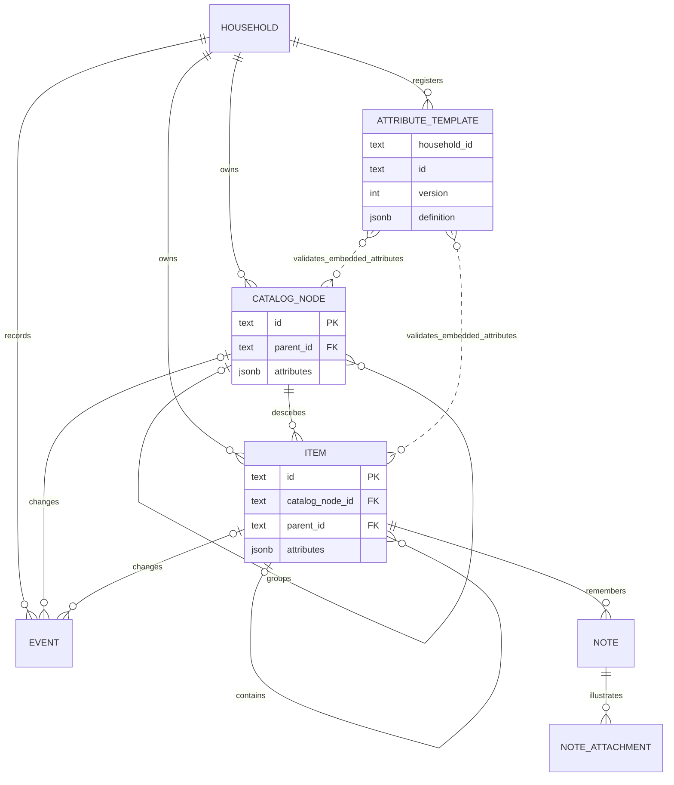
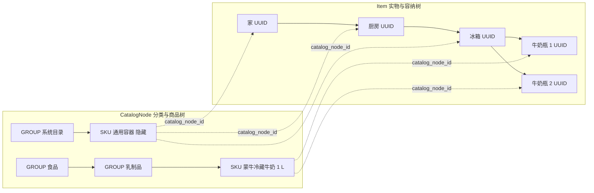

# Domain model v1

本文是 Acornary 唯一的领域模型基线，定义领域契约；Stage1 已有运行代码与 PostgreSQL migration，后续能力仍按阶段边界实施。实际验证范围见 [验证记录](./stage1-verification.md)。接口见 [Architecture](./architecture.md)，实例见 [Examples](./examples.md)。

本文保留长期领域契约；Stage1 的交付子集以 Architecture 为准。Stage1 实现两棵树、七个模板 v1、明确 UUID 的库存操作、文字 Note 和 Event；NoteAttachment 与模板升级属于后续阶段，不因出现在静态模型中而纳入首阶段实施。

## 1. 目标与身份

Acornary 用两棵树回答“是什么”和“在哪里”：

- **CatalogNode 树**组织分类与商品定义。GROUP 是分类节点，SKU 是具体商品叶节点。
- **Item 树**组织实际物品、空间与容器。每件实物有自己的 UUID，并引用一个 SKU。
- **AttributeTemplate / 内嵌 attributes** 表达受控的结构化扩展。
- **Event** 解释事实如何变化；**Note / NoteAttachment** 保存用户的文字、图片与故事。

买六瓶相同牛奶，建立六个 Item UUID，共用一个 CatalogNode ID。即使它们已知属性完全相同，也不合并记录。开封、喝掉一半、移动、纠错都沿用原 UUID。

同一个 SKU 只保证商品定义相同，不保证批次、到期日期、开封情况、剩余量、位置相同。UUID 标识系统中的实物记录，普通商品条码识别的是 SKU；没有单件标签时，不能据此声称识别出了现场某一瓶。

## 2. 静态结构

核心三张表为 catalog_nodes、items、attribute_templates；整个 Stage1 数据库共十一张表。属性绑定直接位于所属对象的 attributes JSONB 中，不是独立实体。图中模板校验关系由领域服务保证，不是数据库外键；模板按所属家庭、ID 和版本定位。Event 恰好记录一个 CatalogNode 或 Item 的变化。NoteAttachment 是后续领域实体，尚未建表。自关联的父节点可为空；每个家庭允许多个根，界面可以将它们显示在一个虚拟根下，虚拟根不是第三类领域实体。

实线分别表示分类、容纳；虚线表示定义与实例的关联。冰箱已知真实商品规格时可改用其真实 SKU，同时保留自身 UUID、子节点和容器能力。

## 3. 核心实体

### 统一 ID 表示

数据库 text 列、外键、HTTP、MCP、Web 和结构化事件引用均采用完整实体前缀加标准 36 字符小写 UUID；显示和复制均不截断。

| 实体 | 格式 |
| --- | --- |
| CatalogNode | `catalog_node_<UUID>` |
| Item | `item_<UUID>` |
| Household | `household_<UUID>` |
| Actor | `actor_<UUID>` |
| Note | `note_<UUID>` |
| Event | `event_<UUID>` |
| 操作关联 | `operation_<UUID>` |

前缀外的 UUID 保留原值；新建使用 UUID v4，输入及数据库检查前缀与标准 UUID 语法。模板键、模板版本、幂等键、初始化槽位和迁移文件名是语义键，不改成 UUID。内嵌属性绑定没有独立 ID。`expected_revisions` 的键也使用完整新格式。

Actor 表保存 `id`、`household_id`、`name`；个人访问凭证只在本地配置中，不在此表或调试 API 中。

### Household

Household 是数据和权限边界，核心字段为 `id`、`name`、`timezone`、`created_at`、`updated_at`。`timezone` 用于日期型提醒。成员授权由应用层处理；调用者提供 household_id 不构成授权。

### CatalogNode

| 字段 | 契约 |
| --- | --- |
| `id` | 系统生成的 `catalog_node_<UUID>` 稳定字符串；不由名称、分类路径或条码计算 |
| `household_id` | 所属家庭 |
| `parent_id` | 同家庭 GROUP 的 ID；根为 null |
| `kind` | `GROUP` 或 `SKU` |
| `name` | 分类名或商品名 |
| `attributes` | 非 null 的 JSONB 数组；默认 []，受控模板绑定，结构见第 4 节 |
| `revision` | 正整数，创建为 1，每次实际变化递增 |
| `created_at` / `updated_at` | 系统记录时间 |

GROUP 用于目录组织，不被 Item 实例化。SKU 没有 CatalogNode 子节点；其下多瓶牛奶属于另一棵 Item 树。商品包装组合不借用分类父子关系表达。

改名、移动分类、修正条码不改变 ID。本次表示迁移保留 UUID 部分；统一格式后，应用不接受旧前缀或裸 UUID 别名。实质不同的商品规格应建立新 SKU；纠正某件物品的错误 SKU 引用属于显式纠错，保留 Item UUID 并记录前后引用。

品牌、规格、条码、储存要求、目录可见性均通过模板表达。条码不是主键；条码扩展可保存多个标识，同家庭内同一有效标识只映射到一个 SKU。没有条码的物品可以先建立本地 SKU，不要求先接入外部商品库。

### Item

| 字段 | 契约 |
| --- | --- |
| `id` | 系统生成的 `item_<UUID>` 字符串，每件实物不同 |
| `household_id` | 所属家庭 |
| `catalog_node_id` | 同家庭 SKU 的稳定 ID，必填 |
| `parent_id` | 同家庭具备容器能力的 Item UUID；根为 null |
| `display_name` | 可选的单件名称；为空时显示 SKU 名称 |
| `attributes` | 非 null 的 JSONB 数组；默认 []，受控模板绑定，结构见第 4 节 |
| `revision` | 正整数，创建为 1，每次实际变化递增 |
| `created_at` / `updated_at` | 系统记录时间 |

`position` 是 API/UI 对父引用的称呼。唯一持久化关系是 `parent_id`；不另存可独立修改的位置字符串或绝对路径。根表示顶层放置，不自动表示“位置未知”；位置未知可使用明确命名的容器节点。

实际记录粒度在入库时明确：一瓶奶、一袋洗衣液、一根线各是一件；袋内剩余内容通过模板计量。六个被分别追踪的鸡蛋是六件，整盒作为一件追踪时则是一个包装实例，其内容量可以用 count 表达。两者不能在同一统计中重复计数，也不能用一条记录代表六瓶独立追踪的牛奶。v1 不自动拆包生成新的实物身份。

实例没有持久化“件数”字段。开封不拆分实例，修正剩余量也不新建实例。生命周期终结后保留记录和历史，统计按显式条件排除它，而非删除记录来扣减件数。

### 空间与容器

每个家庭初始化一个隐藏的通用容器 SKU，其 ID 同样由系统生成并保持稳定。系统通过内部角色映射找到它，不依赖名称或写死的示例 ID。隐藏仅影响普通商品浏览，不代表权限隔离。

创建家、厨房、抽屉等空间时，创建引用此 SKU 的 Item，设置 display_name，并显式绑定容器模板。真实冰箱、行李箱可以引用实际 SKU，再绑定相同容器模板。容器能力属于 Item，不从 SKU 隐式继承。

移动容器只更新它自身的 parent_id。子物品仍指向原来的直接父节点；完整路径由查询推导。`path_ids` 不存储；`get_item`、`get_catalog_node` 及两种树查询只有显式 `include_path=true` 才返回它。父节点存在、权限、同家庭、容器能力和无环约束必须在写入时验证，不能只依赖客户端检查。

## 4. 模板定义与属性值

### AttributeTemplate

| 字段 | 契约 |
| --- | --- |
| `id` | 模板家族的稳定键，如 `contents`；适用对象由 target_kind 声明 |
| `household_id` | 模板注册所属家庭；内置定义可由系统为家庭初始化 |
| `version` | 正整数；`household_id + id + version` 唯一定位一个发布版本 |
| `name` | 显示名称 |
| `target_kind` | `CATALOG_NODE` 或 `ITEM` |
| `allowed_catalog_node_kinds` | CatalogNode 模板限定 GROUP / SKU 的适用范围 |
| `fields` | 字段路径、类型、单位、枚举、范围、条件依赖等受控声明；业务字段默认可选 |
| `created_at` | 发布记录时间 |

已发布版本不可原地修改；变化发布为新版本。模板只使用受支持的声明，不接受可执行代码。v1 提供内置、已注册模板及它们的绑定接口，不把模板设计器或任意用户 schema 编译作为必需能力。

字段可使用 STRING、BOOLEAN、INTEGER、DECIMAL、DATE、DATETIME、ENUM、受约束列表及 MEASUREMENT。DECIMAL 在线上传十进制字符串；MEASUREMENT 是 `{ "value": "500", "unit": "mL" }` 这样的受控对象。Measurement 可整体缺省，填写时 value 与 unit 必须一起提供。嵌套字段同样封闭校验，不允许以任意对象绕过模板。

对外完整路径使用 `模板.字段`，例如 lifecycle.expiry.date；内嵌绑定的 values 保存嵌套对象，不保存任意 dotted-key。更新接口中的路径相对于模板，例如 template_id=lifecycle 时使用 expiry.date。路径不携带身份或父引用，不能用于改写核心关系。

日期型事实使用 `YYYY-MM-DD`，不虚构时分秒；DATETIME 使用带时区的时间戳。具体单位和上下限由模板约束，质量、体积、件数之间不能无依据换算。

实际 `attribute_templates` 行保存 `household_id`、`id`、`version`、`target_kind`、`definition`、`created_at`；名称、适用种类、字段 Schema 和校验元数据位于 definition JSONB，而非独立列。上表表达领域定义，调试区按实际行展示。

### 内嵌属性绑定

`items.attributes` 和 `catalog_nodes.attributes` 是 `jsonb NOT NULL DEFAULT '[]'::jsonb`；数据库检查其为数组。列表持久化时按 template_id 排序，顺序不表达业务含义。

| 数组成员字段 | 契约 |
| --- | --- |
| `template_id` / `template_version` | 所属家庭内的固定发布版本 |
| `values` | 严格符合模板的嵌套对象 |
| `created_at` / `updated_at` | 绑定创建／实际值变化时间，保留完整时间精度 |

所属对象和家庭由核心行确定，不在成员中重复保存，也没有独立绑定 ID。一个对象可有多个不同模板，通过“目标对象 + template_id”操作。

共享领域服务校验绑定结构、重复模板、同家庭模板版本存在性、适用对象及完整 values；非法绑定返回 ATTRIBUTE_VALIDATION_FAILED。数据库不再提供原绑定表的模板外键或对象／模板唯一索引，不增加引用校验触发器。直接 SQL 可绕过这些语义校验；数据库仍检查 attributes 非 null 且为数组，并保留核心关系原有约束。

业务响应 attributes 每项只返回 template_id、template_version、values；`get_attribute_sets` 保留为内嵌绑定的读取投影。检查器直接展示核心行中的完整 attributes，并在“内嵌属性”展开绑定时间。模板定义仍单独存在 attribute_templates，不复制到对象中。

实际值变化仅更新对应绑定的 updated_at，其他绑定时间不变；无变化请求不更新对象时间或 revision，也不产生 Event。移除后重新建立绑定会生成新的创建／更新时间。事件仍使用 attributes.contents.remaining 等模板路径，不用数组下标。

同一对象对同一模板家族只能有一个当前绑定版本。升级由显式命令提供新版本和完整合法值；旧版本、旧值保留在 Event 中。实际绑定、更新、升级、移除都会递增所属对象 revision，并与所属对象的 Event 同事务提交。

所有业务字段默认可选；模板可以只记录一个已知字段。缺失表示未知，不能补成 ACTIVE、AVAILABLE、SEALED 或 MEASURED，也不使用 null 代替缺失。开封、整件消耗等明确意图可以原子创建最小绑定，记录实际发生的事实。只有操作确实缺少必要事实时才返回 MISSING_FACTS，指出所需路径与用途；例如减去 200 mL 需要 contents.remaining，而不需要先补齐 lifecycle。

创建可以不提供任何属性，也可以明确提供初始模板和值。空 values 不形成持久绑定；清除最后一个字段时移除绑定。移除整个绑定、清除字段及模板升级都要检查修改后的完整对象，不能因此撤销仍被子节点使用的容器能力或绕过终结状态保护。

分类和 SKU 均不向下隐式继承属性。UI 可以提出待确认的初始值，但必须显式写到对应对象，后续修改 SKU 不会联动覆盖实例。

### v1 模板目录

以下七个模板及版本 1 是文档示例的共同契约；这是 Stage1 内置模板基线，不保留平行模板别名。业务字段均在 内嵌绑定的 values 中，表中的字段全部可选，填写后才校验。

| 模板键 | 对象 | 字段和关键约束 |
| --- | --- | --- |
| `product` | CatalogNode，限 SKU | `brand`、`model`、`specification` 为字符串；`barcodes` 为非空字符串列表并校验合法性及同家庭唯一映射；`net_content: MEASUREMENT` 为正值，单位 mL / g / count，count 为整数；`storage.requirement` 为 AMBIENT / REFRIGERATED / FROZEN |
| `lifecycle` | Item | 生命周期、状况、可用性、开封、日期与购入信息，见下面的路径表 |
| `contents` | Item | `remaining: MEASUREMENT` 非负，单位 mL / g / count / percent，percent ≤ 100，count 为整数；`accuracy` 为 ESTIMATED / MEASURED，可缺省 |
| `container` | Item | `can_contain: BOOLEAN`；只有明确 true 才能作为父节点 |
| `catalog` | CatalogNode，限 SKU | `visibility` 为 VISIBLE / HIDDEN；缺省使用 VISIBLE 展示策略，不补写事实 |
| `clothing` | CatalogNode，限 SKU | `material`、`color`、`size`，字符串 |
| `device` | CatalogNode，限 SKU | `connector: STRING`、`rated_power_w: DECIMAL`，功率正值 |

| lifecycle 完整路径 | 类型与含义 |
| --- | --- |
| `lifecycle.state` | ACTIVE / CONSUMED / DISPOSED / LOST / ARCHIVED |
| `lifecycle.condition` | NEW / GOOD / WORN / DAMAGED / BROKEN |
| `lifecycle.availability` | AVAILABLE / IN_USE / LOANED / CLEANING / MAINTENANCE / IN_TRANSIT |
| `lifecycle.opening.state` | SEALED / OPENED |
| `lifecycle.opening.opened_at` | DATETIME，已知开封时间 |
| `lifecycle.expiry.date` | DATE，已知到期日期 |
| `lifecycle.expiry.date_kind` | BEST_BEFORE / USE_BY / ESTIMATED |
| `lifecycle.expiry.after_opening_days` | 正整数，开封后保质天数 |
| `lifecycle.acquisition.acquired_on` | DATE，购入日期 |
| `lifecycle.acquisition.batch_label` | STRING，已知批次或来源标记 |

只填写 expiry.date 合法，不要求 date_kind；只填写 after_opening_days 也合法。只填写 opening.opened_at 足以推导已开封，不要求同时持久化 opening.state；但明确 SEALED 与 opened_at 并存时拒绝。日期或开封信息缺省时保留未知，不自动补造。

模板内枚举不是核心实体的固定列；新能力先通过受控模板注册扩展。需要新业务行为时仍需领域代码，模板不等于通用业务脚本。

## 5. 数量、状态与日期

### 件数和内容量是不同查询

- `matching_count`：满足所有明确过滤条件的 Item 数量。
- `current_count`：在上述范围内排除明确 lifecycle.state 为 CONSUMED / DISPOSED / LOST / ARCHIVED 的对象，包含 lifecycle.state 缺省对象。
- `unknown_lifecycle_count`：current_count 范围中 lifecycle.state 缺省的数量；整个 lifecycle 缺失或仅有日期都算未知状态。
- 明确查询 ACTIVE 或 AVAILABLE 时只匹配对应路径的已知值；“可用”查询还排除上述终结状态，报告可用性未知，不把默认库存计入等同于确认可用。
- `content_totals`：相同量纲、可换算单位下的已知剩余内容汇总，保留估计／实测和缺失数据说明。不能直接相加百分比，也不能从“有六瓶”推断“剩六升”。

物品类别过滤通过 CatalogNode 子树完成；位置过滤通过 Item 子树完成。容器实例只有符合类别条件时才参与该商品计数。生命周期、状况、可用性相互独立，例如衣服可以同时 ACTIVE、WORN、CLEANING。

只有核心字段的 Item 也可参与日常库存及明确的开封、整件消耗操作。开封只记录 opening 事实，部分消耗只更新已知 contents；两者都不自动补写 lifecycle.state=ACTIVE。已知终结状态仍阻止普通消耗。

消耗两件将明确选中的两个实例记为 lifecycle.state=CONSUMED；即使之前未绑定 lifecycle，也可在同一事务中创建最小绑定。部分消耗要求已知 contents.remaining、正数扣减量和可解释的单位。内容量降至零时，同一事务记录 CONSUMED；仍大于零时不会把单件身份变成分数。

完整消耗时，已有 remaining 同步归零；若只有 accuracy 而无 remaining，仍属于没有计量事实，不能凭空补单位。将已知终结状态清除或改成 ACTIVE，以及通过移除整个 lifecycle 绑定恢复库存资格，都必须使用带原因的 correct_item；普通属性操作不能绕过。若物理空包装需要继续管理，作为后续包装转化用例单独设计，v1 不自动创建空瓶。

### 日期与派生结果

lifecycle.expiry 保存已知日期、日期含义或开封后天数；lifecycle.opening 保存开封事实。已知 expiry.date 可独立用于日期查询；只有 after_opening_days 而缺 opened_at 时不能推导开封后提醒日期。同时已知二者时，按家庭时区计算开封后日期；若还知道 expiry.date，取两者更早值，响应返回依据。未知 date_kind 保持未知。这些事实与规则均属于该 Item，不能放入 SKU 默认策略。

日期 D 在家庭本地日期晚于 D 时视为已过期；今天至未来 N 天（含端点）属于指定的临期窗口。不同 date_kind 在查询结果中保留，不把提醒推导当作食品安全保证。缺失日期保持未知，不能参加假定已知的 FEFO 排序。

“临期”、完整位置路径、分组件数是派生结果。时间流逝和祖先移动不触发后代对象状态更新，也不生成相应的伪变更事件。

## 6. Event 与事务

Event 是当前快照之外的追加式历史，不是重建所有当前状态的唯一来源。

| 字段 | 契约 |
| --- | --- |
| `id` / `household_id` | 事件身份及所属家庭 |
| `target_kind` / `target_id` | `CATALOG_NODE` 或 `ITEM` 及其稳定 ID，事件创建时校验真实对象与家庭 |
| `operation_id` | 同一次成功领域操作的关联标识 |
| `event_type` | 明确业务意图，见下表 |
| `before_revision` / `after_revision` | 对象前后版本；创建时前版本为 0 |
| `changes` | 实际变化的核心字段／属性路径／记忆及 before / after；属性路径如 attributes.contents.remaining，并携带 template_id 与 template_version；只由服务生成 |
| `actor_id` / `source` | 操作者及 `WEB / MCP / IMPORT / SYSTEM` 来源 |
| `occurred_at` / `recorded_at` | 实际发生时间和系统记录时间 |

Stage1 事件类型：`CREATE`、`UPDATE`、`MOVE`、`ATTRIBUTE_BIND`、`ATTRIBUTE_UPDATE`、`ATTRIBUTE_REMOVE`、`OPEN`、`CONSUME_ITEMS`、`CONSUME_CONTENT`、`CORRECT`、`NOTE_CREATE`、`NOTE_UPDATE`。模板升级及附件事件后置。

一次命令对一个对象的全部实际变化合并成一个 Event、一次 revision 增量。例如“喝掉最后 200 mL”同时改变 contents 和 lifecycle，但只有一个 CONSUME_CONTENT 事件。六件入库则产生六个 CREATE 事件，共用 operation_id。

事件中的 changes 是审计输出。属性更新的 set / unset 只接受模板已声明路径，校验修改后的完整对象；核心字段使用专用命令。专用命令和通用模板命令共享业务校验，例如把内容量改成零，同样要求生命周期一致。缺省与 null 区分：事件的 before_present / after_present 表示路径是否存在，不存在一侧省略对应 before / after 值。绑定创建／移除记录模板及版本的前后存在性，版本升级另外记录前后版本；都包含于同一对象事件，不额外递增 revision。

幂等重试返回原结果，不生成新 UUID、Event 或 revision。合法无变化请求返回 `changed=false`，不制造状态变化事件，但仍保存 operation_id、指纹及完整结果，可从操作记录视图查询。失败不留下部分快照或事件。修正历史事实通过新的 CORRECT 事件表达，不改写旧 Event，也不承诺任意历史操作都能自动撤销。

## 7. Note 与附件

Note 核心字段：`id`、`household_id`、`item_id`、可选 `title`、`body`、`body_format`、`created_by`（Actor 外键）、`created_at`、`updated_at`。v1 body_format 使用 Markdown。Note 是自由记忆，不纳入属性模板。

NoteAttachment 核心字段：`id`、`household_id`、`note_id`、`storage_key`、`mime_type`、`file_size`、可选 `width` / `height` / `caption`、`sort_order`、`created_at`。文件在附件存储，数据库保存关联和元数据。

记忆变化归属 Item：创建／修改 Note、完成附件关联时递增所属 Item revision，写入包含 note_id 或 attachment_id 及变更的事件。上传二进制尚未完成关联时不算物品变化。

AI 提取的 OCR、图片描述、候选事实与用户原始记忆分开保存。笔记中的“喝掉一半”不会自动修改 contents；需要用户意图对应的领域写操作。

## 8. 持久化与不变量

PostgreSQL 保存核心关系、模板版本、属性绑定、Note 元数据和 Event。关系使用正式列与外键；业务属性统一放在受模板校验的 JSONB，常用属性可建立索引。查询优化的投影不能成为第二个可独立写入的事实源。

必须保证：

1. 每件 Item UUID 独立；两棵树的身份与路径、条码无关。
2. 两棵树无环、引用存在且同家庭；CatalogNode 父为 GROUP，Item 只引用 SKU，容纳父节点具备能力。
3. 被实例引用的 SKU 不得直接删除；有子节点的容器不得直接删除或撤销容器能力。v1 不提供物理删除历史的通用接口。
4. 已发布模板不可变；业务字段默认可选，存在的属性须满足目标、版本、类型、单位、范围和条件依赖；不接受未知路径或矛盾事实。
5. 业务状态不在核心字段与模板中双写；缺失值不自动变成肯定事实。
6. 默认库存包含状态未知的实例并报告未知数量；明确状态查询不推断缺省值。内容量非负，单位换算有依据。
7. 所有对象事实变化、所属 revision 和 Event 原子提交；事件不可回写，批量失败全部回滚。
8. 幂等和并发校验覆盖 Web、MCP 与其他入口；树变更还需防止并发操作各自校验通过后合成环。
9. 修正一件物品的状态或计量沿用 UUID，不能通过新建记录掩盖历史。
10. 派生路径、临期、分组统计不是可写事实；隐藏目录项仍遵守普通权限检查。

这些是实现验收要求，不代表本仓库已经具有数据库约束、锁策略实现或运行时测试结果。
