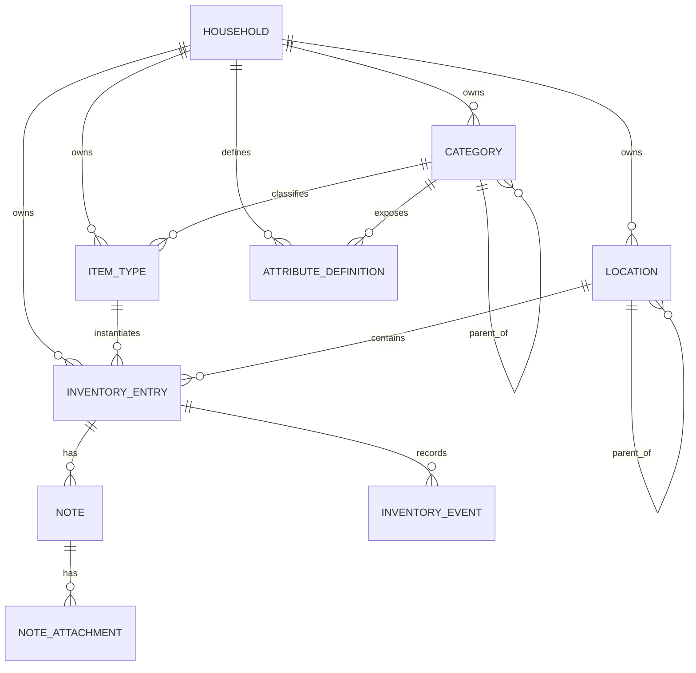

# Domain model v1

## 1. Design principles

### 1.1 Orthogonal dimensions

“是什么、在哪里、有什么特征、现在怎么样”必须分别建模，不使用一棵万能标签树。

例如一个苹果可以同时是：

```text
category            = Food > Fruit > Apple
storage_requirement = refrigerated
location            = Home > Kitchen > Refrigerator > Drawer 2
color               = red
```

其中只有 `Apple` 属于分类体系；冷藏要求、当前位置和颜色分别属于属性、位置和特征。

### 1.2 Stable core, extensible edges

新增药品、工具、衣服、电子设备、收藏品等类别时，应优先通过以下方式扩展：

- Category taxonomy
- AttributeDefinition
- ItemType defaults / policies
- Note
- Event metadata

避免为了每一种新物品修改核心表结构。

### 1.3 Facts vs derived state

保存事实，不重复保存可以可靠推导的状态。

例如保存：

```text
expires_at = 2026-09-25
```

而不是长期保存：

```text
freshness_status = EXPIRING_SOON
```

“已过期 / 即将过期 / 新鲜”应由当前时间与 `expires_at` 实时推导，避免状态漂移。

### 1.4 Structured truth vs unstructured memory

- **Attribute**：机器需要查询、筛选、比较和推理的结构化事实。
- **Note**：用户自由记录的文字、图片、做法、故事和经验。

Note 不应被强迫 ontology 化。

---

## 2. Core model



核心关系：

```text
Household
├── Category Tree
├── Location Tree
├── Attribute Definitions
├── Item Types
└── Inventory Entries
    ├── quantity / identity
    ├── location
    ├── attributes
    ├── state
    ├── expiry / lifecycle
    ├── notes
    │   └── attachments
    └── events
```

---

## 3. Household

Acornary 的数据归属边界。

Suggested fields:

```text
Household
- id
- name
- created_at
- updated_at
```

未来权限、成员与共享策略围绕 `household_id` 建立。

---

## 4. Category

Category 只回答：

> 这个东西是什么？

Suggested fields:

```text
Category
- id
- household_id
- parent_id nullable
- name
- code nullable
- description nullable
- created_at
- updated_at
```

示例：

```text
Physical Item
├── Food
│   ├── Vegetable
│   │   └── Tomato
│   ├── Fruit
│   ├── Egg
│   └── Frozen Food
│       └── Dumpling
├── Apparel
│   ├── Top
│   ├── Pants
│   ├── Hat
│   └── Shoes
├── Electronics
│   ├── Computer
│   ├── Charger
│   └── Cable
├── Household Supplies
├── Tools
└── Books
```

禁止将“冷藏 / 冷冻 / 红色 / 春季 / 损坏”等不同维度混进 Category tree。

---

## 5. AttributeDefinition

不同 Category 可以声明不同结构化属性，而不增加数据库列。

Suggested fields:

```text
AttributeDefinition
- id
- household_id
- category_id
- key
- display_name
- data_type
- required
- validation_schema jsonb
- default_value jsonb nullable
- created_at
- updated_at
```

推荐 `data_type`：

```text
STRING
INTEGER
DECIMAL
BOOLEAN
DATE
DATETIME
ENUM
MULTI_ENUM
MEASUREMENT
COLOR
```

示例：

```text
key          = warmth
display_name = 保暖程度
data_type    = INTEGER
validation   = { "min": 1, "max": 5 }
applies_to   = Apparel
```

或者：

```text
key          = sleeve_length
data_type    = ENUM
values       = SHORT | LONG | SLEEVELESS
```

具体值可以存储在 `ItemType.attributes` 或 `InventoryEntry.attributes` 的 JSONB 中，但写入必须经过 AttributeDefinition 校验。不要把 JSONB 当作无 schema 的垃圾桶。

---

## 6. ItemType

ItemType 表示“哪一种东西”，不是用户手上某一个具体实例。

Suggested fields:

```text
ItemType
- id
- household_id
- category_id
- name
- brand nullable
- model nullable
- specification nullable
- default_tracking_mode
- default_unit nullable
- default_attributes jsonb
- inventory_policy jsonb
- created_at
- updated_at
```

示例：

```text
Category:
Food > Frozen Food > Dumpling

ItemType:
湾仔码头 猪肉白菜水饺 720g
```

多次购买同一款商品时，应复用 ItemType，并创建新的 InventoryEntry。

---

## 7. InventoryEntry

系统中最核心的实体，表示当前实际拥有的一批数量型物资，或一个具体独立物品。

Suggested fields:

```text
InventoryEntry
- id
- household_id
- item_type_id
- tracking_mode

- quantity nullable
- initial_quantity nullable
- unit nullable

- location_id nullable

- lifecycle_status
- condition
- availability

- acquired_at nullable
- opened_at nullable
- expires_at nullable

- attributes jsonb

- created_at
- updated_at
```

### 7.1 Tracking mode

v1 只需要两种：

```text
QUANTITY
UNIQUE
```

#### QUANTITY

适合：

- 鸡蛋 × 8
- 大米 3.2 kg
- 牛奶 620 ml
- 洗衣液 40%
- 卫生纸 3 卷

#### UNIQUE

适合：

- 黑色帽子
- MacBook Pro
- USB-C 数据线 #3
- 羽绒服
- 行李箱

Tracking mode 是 ItemType 的默认策略，但 InventoryEntry 应保存实际采用的 tracking mode，方便历史兼容。

### 7.2 Quantity

优先保存：

```text
initial_quantity
quantity
unit
```

例如：

```text
洗衣液:
initial_quantity = 2000
quantity         = 800
unit             = ml
```

UI 可以推导剩余 40%。

如果用户只知道“大约剩一半”：

```text
initial_quantity = 100
quantity         = 50
unit             = percent
```

允许使用 `percent` 作为一种近似单位，但不要同时维护独立的 percentage 字段。

---

## 8. Location

Location 是一棵独立于 Category 的树。

Suggested fields:

```text
Location
- id
- household_id
- parent_id nullable
- name
- type nullable
- linked_inventory_entry_id nullable
- created_at
- updated_at
```

示例：

```text
Home
├── Kitchen
│   ├── Refrigerator
│   │   ├── Refrigerator Compartment
│   │   └── Freezer
│   │       ├── Drawer 1
│   │       └── Drawer 2
│   └── Cabinet
├── Bedroom
│   └── Wardrobe
└── Study
```

### 8.1 Items can be containers

`linked_inventory_entry_id` 允许一个物品同时作为 Location。

例如：

```text
InventoryEntry: Black Suitcase

Location tree:
Home
└── Bedroom
    └── Black Suitcase
        ├── USB-C Cable
        ├── Charger
        └── Travel Pouch
```

移动行李箱时，不需要逐个修改内部物品相对位置。

必须防止 location graph 出现环。

---

## 9. State

禁止把所有状态压缩成单一 `status` 字段。

### 9.1 lifecycle_status

表示物品生命周期是否仍然存在于当前库存中：

```text
ACTIVE
CONSUMED
DISPOSED
LOST
ARCHIVED
```

### 9.2 condition

表示物理状况：

```text
NEW
GOOD
WORN
DAMAGED
BROKEN
```

### 9.3 availability

表示当前是否可使用：

```text
AVAILABLE
IN_USE
LOANED
CLEANING
MAINTENANCE
IN_TRANSIT
```

例：

> 黑色大衣已有磨损，正在外面干洗。

表示为：

```text
lifecycle_status = ACTIVE
condition        = WORN
availability     = CLEANING
```

这样不会产生“到底应该标 worn 还是 dry_cleaning”的冲突。

---

## 10. Expiry and lifecycle

保存事实：

```text
acquired_at
opened_at
expires_at
```

可以在 ItemType 的 `inventory_policy` 中定义默认规则，例如：

```json
{
  "expiry": {
    "unopened_shelf_life_days": 30,
    "after_opening_days": 3
  }
}
```

Derived state：

```text
expired       := now > expires_at
expiring_soon := 0 < expires_at - now <= configured_threshold
```

Worker 负责发送提醒，而不是负责“把 normal 改成 expired”以维持事实。

---

## 11. Note and NoteAttachment

Note 是一等实体，不属于 attributes。

### 11.1 Note

Suggested fields:

```text
Note
- id
- inventory_entry_id
- title nullable
- body
- body_format
- created_by nullable
- created_at
- updated_at
```

`body_format` v1 可以支持 Markdown 或受控 Rich Text。

一个 InventoryEntry 可以拥有多个 Note。

使用场景：

- 一袋饺子的煮法
- 一个锅不能使用钢丝球的提醒
- 一顶帽子的购买故事
- 某件设备的安装步骤
- 某个收藏品的来历

### 11.2 NoteAttachment

Suggested fields:

```text
NoteAttachment
- id
- note_id
- storage_key
- mime_type
- file_size
- width nullable
- height nullable
- caption nullable
- sort_order
- created_at
```

图片二进制存储于 S3 / Cloudflare R2 / MinIO 等 Object Storage，PostgreSQL 只保存 key 与元数据。

AI 未来生成的 OCR、caption、embedding 应作为派生数据保存，不覆盖用户原始 Note。

---

## 12. InventoryEvent

InventoryEvent 是 append-only 的审计 / 历史事件层。

v1 **不采用完整 Event Sourcing**：当前状态仍然存储在 InventoryEntry；Event 用于解释变化、审计、Undo 和统计。

Suggested fields:

```text
InventoryEvent
- id
- household_id
- inventory_entry_id
- event_type
- quantity_delta nullable
- from_location_id nullable
- to_location_id nullable
- metadata jsonb
- source
- actor_id nullable
- occurred_at
- created_at
```

建议事件类型：

```text
ACQUIRE
CONSUME
ADJUST
MOVE
OPEN
EXPIRE
CHANGE_STATE
DAMAGE
REPAIR
LOAN
RETURN
DISCARD
CREATE_NOTE
UPDATE_NOTE
```

推荐 source：

```text
APP
VOICE_ASSISTANT
MCP
IMPORT
SYSTEM
```

---

## 13. Persistence strategy

推荐 PostgreSQL：

- 核心关系和高频查询字段使用正式列。
- 类别特有属性使用 JSONB。
- JSONB 写入必须由 AttributeDefinition 校验。
- Note attachment 使用 Object Storage。
- 常用查询建立普通索引与 JSONB 索引。
- 所有库存变化与对应 Event 在同一个数据库事务中提交。

这不是“全部关系型”或“全部 JSON”的二选一，而是稳定核心 + 受控扩展。

---

## 14. Domain invariants

v1 至少应强制以下规则：

1. InventoryEntry、ItemType、Category、Location 必须属于同一 Household。
2. Category tree 不允许环。
3. Location tree 不允许环。
4. 如果 Location 绑定了 container item，不允许形成 item/location 循环引用。
5. `quantity < 0` 默认非法；特殊修正必须通过显式 ADJUST 规则。
6. UNIQUE entry 的语义数量应为一个独立实例，不用于聚合可消耗库存。
7. CONSUMED / DISPOSED / LOST 等终止态默认不参与“当前可用库存”查询。
8. Attributes 必须符合生效的 AttributeDefinition。
9. 结构化状态变化与 InventoryEvent 必须在同一事务中写入。
10. 派生状态（如 expiring soon）不作为长期 source-of-truth 字段保存。
